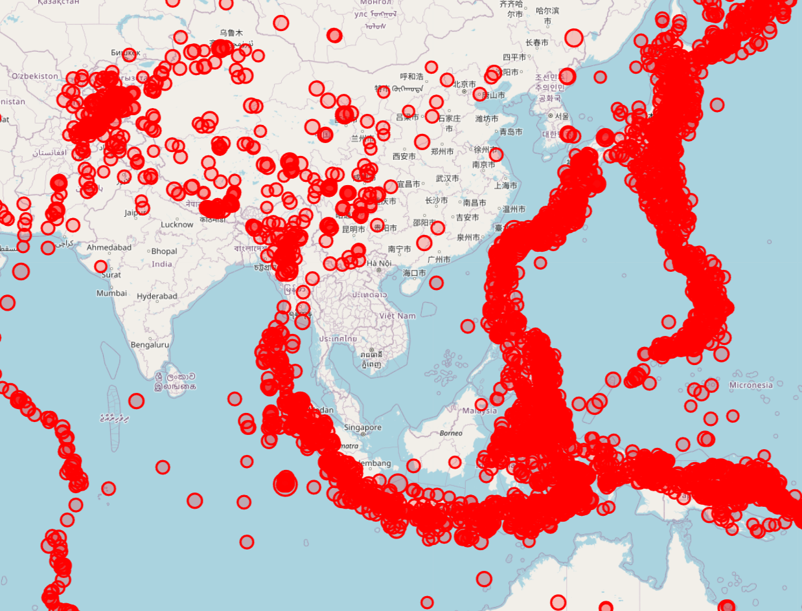
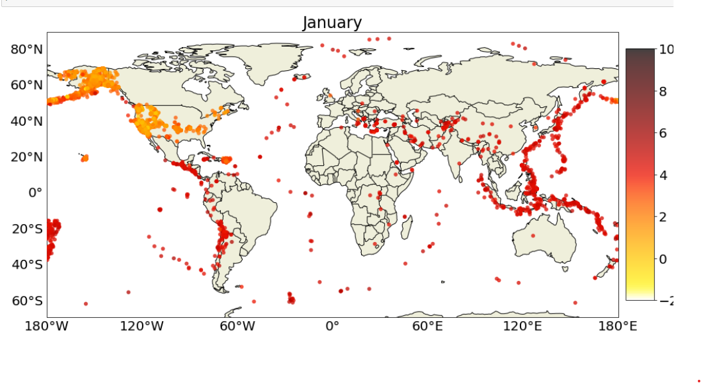

# Earthquake Visualizations Jupyter Notebook

This Jupyter Notebook contains visualizations of earthquake data.

## Overview

This notebook utilizes earthquake data to create insightful visualizations. It aims to provide an understanding of earthquake occurrences, magnitudes, and their distribution over time and geographical locations.

## Content

1. **Data Exploration**: Exploring the earthquake dataset to understand its structure and contents.
2. **Visualizations**:
   - Time series analysis of earthquake occurrences.
   - Geographic distribution of earthquakes using interactive and static maps.
   - Magnitude distribution through histograms and scatter plots.
   - **Interactive Map**: An interactive map displaying the geographical distribution of earthquakes.
3. **Insights**: Analysis and interpretation of the visualizations to gain insights into earthquake patterns and trends.

## How to Use

1. **Requirements**:
   - Python 3.x
   - Jupyter Notebook
   - Required Python libraries: [matplotlib](https://matplotlib.org/), [seaborn](https://seaborn.pydata.org/), [folium](https://python-visualization.github.io/folium/), etc. (install via pip if not already installed)
   
2. **Installation**:
   - Clone or download this repository to your local machine.
   
3. **Execution**:
   - Launch Jupyter Notebook.
   - Open the `earthquake_visualizations.ipynb` notebook.
   - Run each cell sequentially to generate the visualizations.
   
4. **Interactivity**:
   - Some visualizations may be interactive, allowing you to zoom in, hover over points, etc. Follow on-screen instructions for interactivity.
   
## Interactive Map

* Interactive Map Showing Geographic Distribution of Earthquakes*

* Static Map Showing Geographic Distribution of Earthquakes with gradient of magnitude*

## Credits

- The earthquake data used in this notebook is sourced from "https://earthquake.usgs.gov/fdsnws/"
- Libraries used: [matplotlib](https://matplotlib.org/), [seaborn](https://seaborn.pydata.org/), [folium](https://python-visualization.github.io/folium/), etc.
